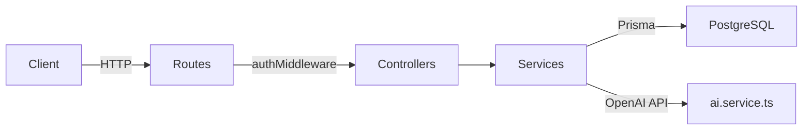
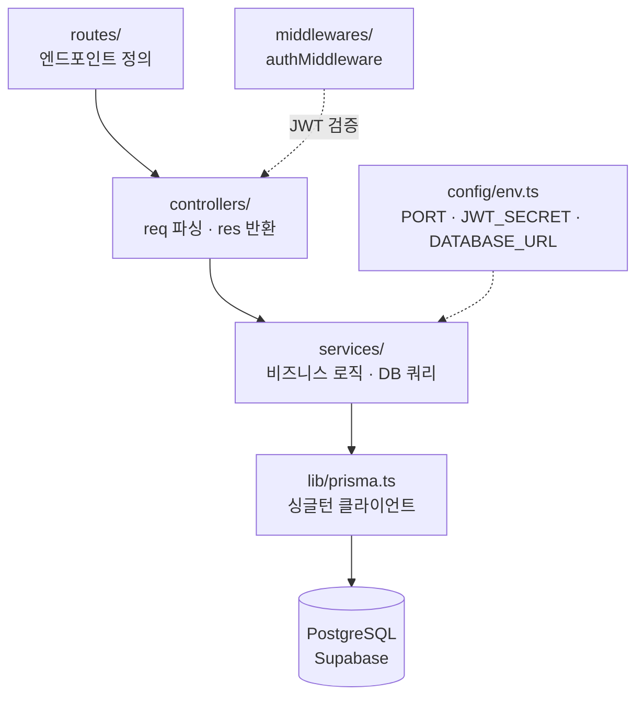
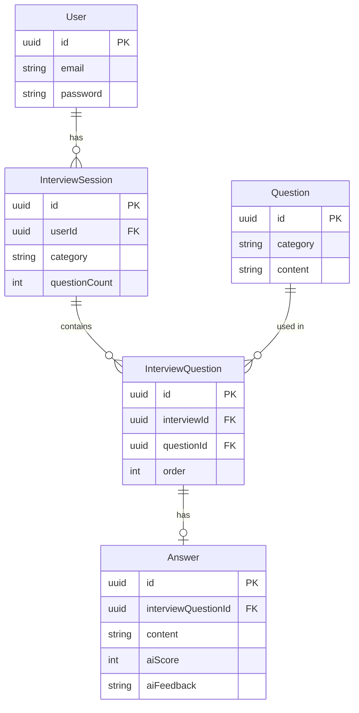

# Architecture

Express + TypeScript 기술 면접 연습 플랫폼.

## 요청 흐름

```mermaid
flowchart LR
    Client -->|HTTP| Routes
    Routes -->|authMiddleware| Controllers
    Controllers --> Services
    Services -->|Prisma| PostgreSQL
    Services -->|OpenAI API| AI["ai.service.ts"]
```

## 레이어 구조

```mermaid
flowchart TD
    R["routes/\n엔드포인트 정의"] --> C["controllers/\nreq 파싱 · res 반환"]
    C --> S["services/\n비즈니스 로직 · DB 쿼리"]
    S --> P["lib/prisma.ts\n싱글턴 클라이언트"]
    P --> DB[(PostgreSQL\nSupabase)]
    M["middlewares/\nauthMiddleware"] -.->|JWT 검증| C
    ENV["config/env.ts\nPORT · JWT_SECRET · DATABASE_URL"] -.-> S
```

## DB 모델 관계

```mermaid
erDiagram
    User ||--o{ InterviewSession : "has"
    InterviewSession ||--o{ InterviewQuestion : "contains"
    Question ||--o{ InterviewQuestion : "used in"
    InterviewQuestion ||--o| Answer : "has"

    User {
        uuid id PK
        string email
        string password
    }
    InterviewSession {
        uuid id PK
        uuid userId FK
        string category
        int questionCount
    }
    InterviewQuestion {
        uuid id PK
        uuid interviewId FK
        uuid questionId FK
        int order
    }
    Question {
        uuid id PK
        string category
        string content
    }
    Answer {
        uuid id PK
        uuid interviewQuestionId FK
        string content
        int aiScore
        string aiFeedback
    }
```
