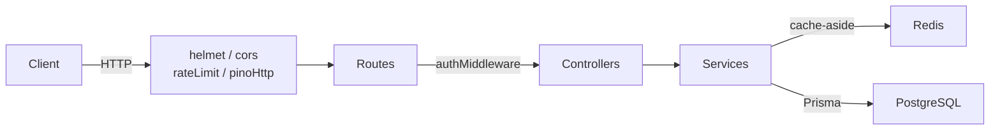
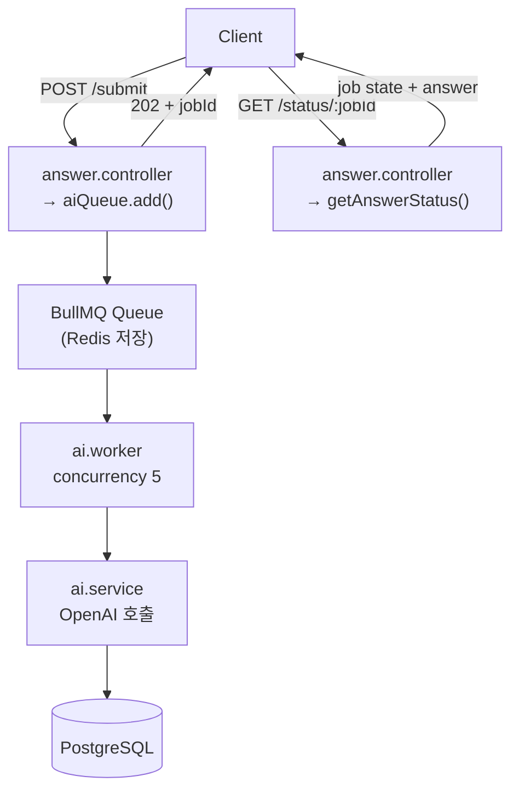
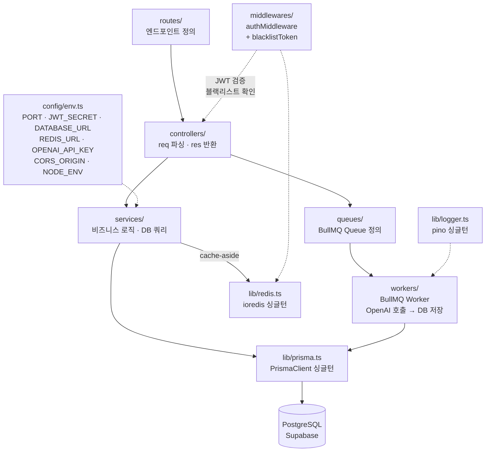
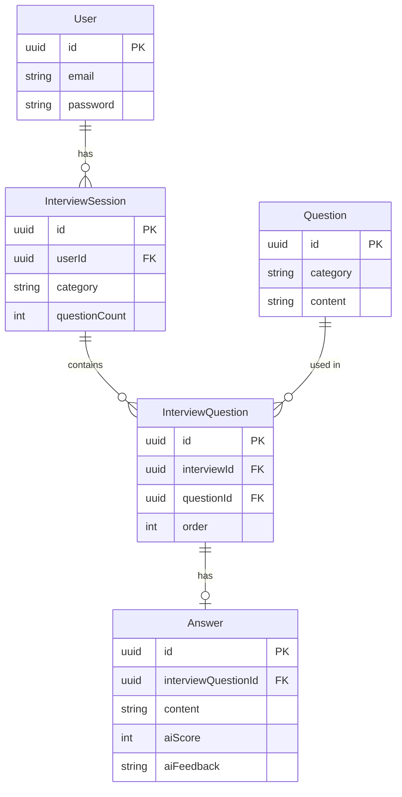

# Architecture

Express + TypeScript 기술 면접 연습 플랫폼.

## 요청 흐름

### 일반 요청 (질문 조회, 인터뷰 시작 등)



### 답변 제출 — 비동기 큐 흐름



## 미들웨어 스택 (적용 순서)

```
요청
  ↓ helmet()         — HTTP 보안 헤더 (XSS, Clickjacking 방어)
  ↓ cors()           — CORS_ORIGIN 환경변수 기반 허용
  ↓ express.json()   — 바디 파싱
  ↓ pinoHttp()       — 구조화 HTTP 로깅
  ↓ rateLimit()      — /api 전체 분당 20회 (Redis 기반)
  ↓ authMiddleware() — JWT 검증 + 블랙리스트 확인 (보호된 라우트만)
  ↓ 라우트 핸들러
```

## 레이어 구조



## 인프라

| 구성 요소 | 역할 |
|------|------|
| PostgreSQL (Supabase) | 주 데이터 저장소 |
| Redis | BullMQ 백엔드 / 질문 캐시 / JWT 블랙리스트 / Rate Limit 카운터 |
| OpenAI API | AI 채점 (ai.worker 내부에서 호출) |

## DB 모델 관계


